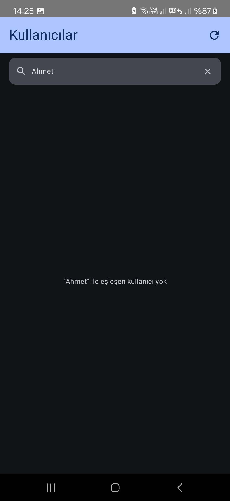
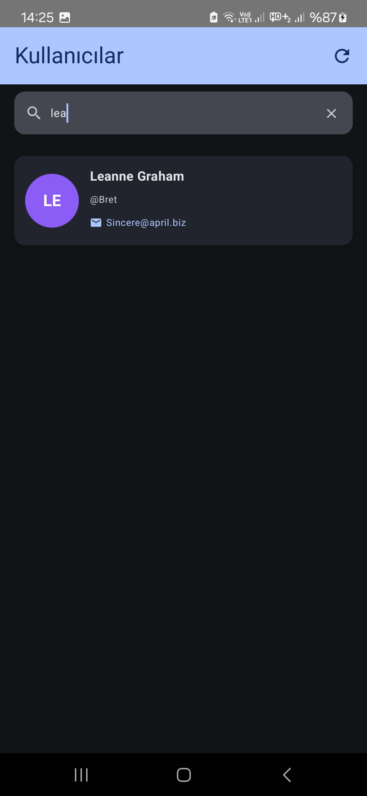
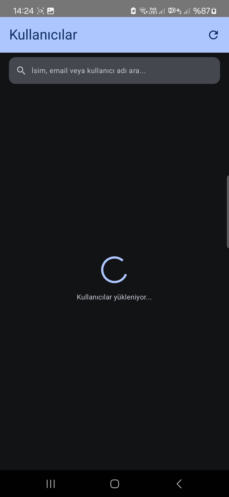
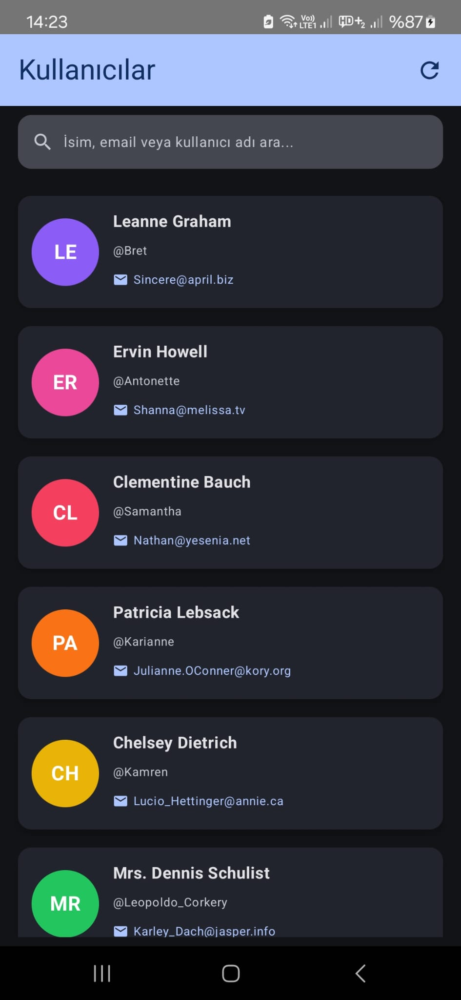

# 📱 UserApp - Kotlin MVVM Projesi

Modern Android uygulaması. **MVVM**, **Jetpack Compose**, **Retrofit** kullanılarak geliştirilmiştir.

---

!()

## 🚀 Proje Özeti

Uygulama, JSONPlaceholder API'den kullanıcı verilerini çekerek liste halinde gösterir.  
Kullanıcılar detay ekranına gidebilir ve listeyi filtreleyebilir.

---

## 🛠️ Kullanılan Teknolojiler

- Kotlin
- MVVM Architecture
- Jetpack Compose
- Retrofit
- Coroutines & StateFlow
- Material 3

---

## ✨ Özellikler

- 🔍 Kullanıcı arama (isim, email, username)
- 📄 Detay ekranı
- 🔄 Pull-to-refresh
- 📄 Kullanıcı Listesi
---

